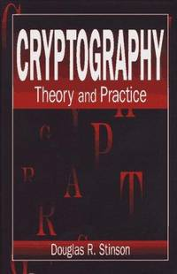

# Cybersecurity

    
  
  
  
  
  
  
   

 

 
 **Equivalent Courses:** [CS4642 @ VirginiaTech](https://courses.cs.vt.edu/~cs4264/) | [CS461 @ UIUC](https://courses.engr.illinois.edu/cs461/sp2018/) | [CMSC33250 @ UChicago](https://www.classes.cs.uchicago.edu/archive/2017/fall/23200-1/index.html) | [EECS398 @ UMichigan](https://www.eecs.umich.edu/courses/eecs398.f10/) | [CS3710 @ UVirginia](https://aaronbloomfield.github.io/ics/readme.html) | [CIS331 @ UPenn](https://www.cis.upenn.edu/~sga001/classes/cis331f19/index.html) | [COMP427 @ Rice](https://comp427.blogs.rice.edu/course-information/) | [CSE571S @ WUStL](https://www.cse.wustl.edu/~jain/cse571-14/index.html) | [COMPSCI597N @ UMass](https://infosec.cs.umass.edu/cs597n) | [CS556 @ ColoradoState](https://www.cs.colostate.edu/~cs556/home_syllabus.php) | [COMPSCI354 @ Northwestern](https://www.mccormick.northwestern.edu/computer-science/academics/courses/descriptions/354.html) | [CS134 @ UCIrvine](https://www.ics.uci.edu/~alfchen/teaching/cs134-2019-Fall/index.html)
