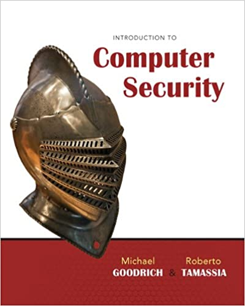

I took the courses CSC 566 (Computer Security) taught by Sazzadur Rahaman and ECE 571 (Fundamentals of Information and Network Security) taught by Ming Li during Spring 2022 (graduate @ UArizona).

For ECE 571 course, I built a SSL/TLS VPN using OpenSSL in SEEDUbuntu 16.04 virtual machine. However, I can't share the project report since the same assignment is given every year. Therefore, in the subfolders above, I have shared the source codes based on the [SEEDLab](https://seedsecuritylabs.org/Labs_16.04/Networking/VPN/) I used for this project. 

Topics covered in these courses:
* Security Mindset (rational paranoia, OSI security architechture)
* Cryptography ([classical cryptosystems](/practice/secret-key_encryption/vigenere.pdf), perfect secrecy, one-time pad, Feistel cipher (DES, 3DES), AES, [block cipher operation modes](/practice/secret-key_encryption/Crypto_Encryption.pdf), [PRNG](/practice/pseudo_random_number_generation/) (LSFR, LCG), [hash functions](/practice/MD5_Collision_Attack/), [RSA](/practice/RSA_Encryption_and_Signature/), Diffie-Hellman (perfect forward secrecy), homomorphic encryption, authenticated encryption (HMAC))
* System Security (access control, MMU, IO-MMU, Bell-LaPadula, Biba, SELinux, Virus detection (halting problem), Intrusion Detection System)
* Software Security ([buffer overflow](/practice/buffer_overflow_vulnerability/), return orinted programming)
* Network Security (KDC, [PKI](/practice/PKI-TLS/certs/), Kerberos v4&5, IPsec, [ARP cache poisoning](/practice/ARP_cache_poisoning/), [IP spoofing](/practice/Scapy_packet_sniffing_spoofing/), [DNS cache poisoning](https://stats.sidnlabs.nl/en/dnssec.html), [BGP hijacking](https://isbgpsafeyet.com/), [SSL/TLS](/practice/PKI-TLS/), Firewall)
* Web Security ([SQL injection](/practice/SQL_Injection_Attack/), CSRF (cookies and tokens), XSS (code injection), Tor)

The reference texts I used (click on the images to visit their websites):

    
  
      
  
   
  
  
  
   

 

 
 **Equivalent Courses:** [CS4642 @ VirginiaTech](https://courses.cs.vt.edu/~cs4264/) | [CS461 @ UIUC](https://courses.engr.illinois.edu/cs461/sp2018/) | [CMSC33250 @ UChicago](https://www.classes.cs.uchicago.edu/archive/2017/fall/23200-1/index.html) | [EECS398 @ UMichigan](https://www.eecs.umich.edu/courses/eecs398.f10/) | [CS3710 @ UVirginia](https://aaronbloomfield.github.io/ics/readme.html) | [CIS331 @ UPenn](https://www.cis.upenn.edu/~sga001/classes/cis331f19/index.html) | [COMP427 @ Rice](https://comp427.blogs.rice.edu/course-information/) | [CSE571S @ WUStL](https://www.cse.wustl.edu/~jain/cse571-14/index.html) | [COMPSCI597N @ UMass](https://infosec.cs.umass.edu/cs597n) | [CS556 @ ColoradoState](https://www.cs.colostate.edu/~cs556/home_syllabus.php) | [COMPSCI354 @ Northwestern](https://www.mccormick.northwestern.edu/computer-science/academics/courses/descriptions/354.html) | [CS134 @ UCIrvine](https://www.ics.uci.edu/~alfchen/teaching/cs134-2019-Fall/index.html) | [CS588 @ Boston](https://www.cs.bu.edu/~goldbe/teaching/cs558y2015.html) | [CS161 @ UCBerkeley](https://inst.eecs.berkeley.edu/~cs161/sp15/)
